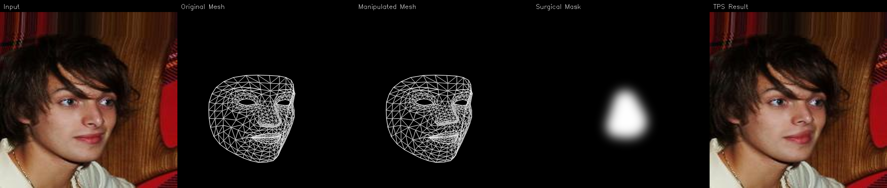
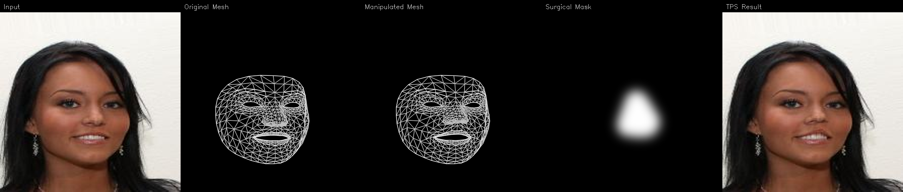

# LandmarkDiff

[](https://github.com/dreamlessx/LandmarkDiff-public/actions/workflows/ci.yml)
[](https://pypi.org/project/landmarkdiff/)
[](https://opensource.org/licenses/MIT)
[](https://www.python.org/downloads/)
[](https://pytorch.org/)
[](https://huggingface.co/spaces/dreamlessx/LandmarkDiff)
[](https://github.com/astral-sh/ruff)

Photorealistic facial surgery outcome prediction from a single photo, powered by anatomically-conditioned latent diffusion.

<table>
<tr>
<td width="50%">

**Input:** Single 2D photo -- any clinical photo or phone selfie
**Output:** Photorealistic post-op prediction
**Just a phone** -- no depth sensors, no clinical equipment

</td>
<td width="50%">

**6 procedures** -- rhinoplasty, blepharoplasty, rhytidectomy, orthognathic, brow lift, mentoplasty
**4 inference modes** -- TPS (CPU), img2img, ControlNet, ControlNet+IP
**5 clinical flags** -- vitiligo, Bell's palsy, keloid, Ehlers-Danlos, Fitzpatrick-stratified eval

</td>
</tr>
</table>

### Where We're Headed

The 2D pipeline ships now and works well. The end goal is full 3D: you hold up your phone, slowly rotate your head, and we reconstruct a 3D face model from that video alone. Surgical deformations then happen in 3D space -- anatomically grounded, not pixel-level warping -- and you get an interactive model you can rotate to see the predicted result from any angle. No depth sensors, no clinical scanning rigs. Just a phone camera and a short video. See the [Roadmap](#roadmap) for details on each step.

LandmarkDiff extracts MediaPipe's 478-point face mesh from the input photo, applies procedure-specific Gaussian RBF deformations calibrated from anthropometric surgical data, renders the deformed mesh as a tessellation wireframe, and feeds that wireframe into a ControlNet-conditioned Stable Diffusion 1.5 backbone to synthesize the predicted face. The output is composited back onto the original image using Laplacian pyramid blending with feathered surgical masks, then refined through neural face restoration and identity verification.

> **Paper:** "LandmarkDiff: Anatomically-Conditioned Latent Diffusion for Photorealistic Facial Surgery Outcome Prediction," targeting MICCAI 2026.

### Try the Live Demo

**[huggingface.co/spaces/dreamlessx/LandmarkDiff](https://huggingface.co/spaces/dreamlessx/LandmarkDiff)** -- runs entirely on CPU, no GPU or local install needed. Upload a photo, pick a procedure, adjust intensity, and see the predicted result with symmetry analysis in seconds.

```bash
# Quick install
pip install -e ".[train,eval,app,dev]"

# Run a prediction
python scripts/run_inference.py photo.jpg --procedure rhinoplasty --intensity 60 --mode controlnet
```

---

## Table of Contents

- [Features](#features)
- [Why LandmarkDiff](#why-landmarkdiff)
- [Supported Procedures](#supported-procedures)
- [How It Works](#how-it-works)
- [Demo Outputs](#demo-outputs)
- [Quick Start](#quick-start)
- [Inference Modes](#inference-modes)
- [Gradio Web Demo](#gradio-web-demo)
- [Symmetry Analysis](#symmetry-analysis)
- [Training](#training)
- [Evaluation and Metrics](#evaluation-and-metrics)
- [Clinical Edge Cases](#clinical-edge-cases)
- [Post-Processing Pipeline](#post-processing-pipeline)
- [Project Structure](#project-structure)
- [Configuration](#configuration)
- [Benchmarks](#benchmarks)
- [Model Zoo](#model-zoo)
- [Requirements](#requirements)
- [Docker](#docker)
- [Roadmap](#roadmap)
- [Citation](#citation)
- [Contributors](#contributors)
- [Contributing](#contributing)
- [License](#license)
- [Acknowledgments](#acknowledgments)

---

## Features

- **Single-photo input** -- works from any 2D clinical photograph or phone selfie, no 3D scanning hardware needed
- **6 surgical procedure presets** -- rhinoplasty, blepharoplasty, rhytidectomy, orthognathic surgery, brow lift, mentoplasty (extensible to custom procedures)
- **4 inference modes** -- TPS (instant CPU), img2img, ControlNet, and ControlNet+IP-Adapter with configurable quality/speed tradeoffs
- **MediaPipe 478-point face mesh** -- anatomically grounded landmark extraction for precise deformation control
- **Gaussian RBF deformation engine** -- smooth, spatially weighted displacements calibrated from anthropometric surgical data
- **ControlNet-conditioned generation** -- photorealistic texture synthesis via Stable Diffusion 1.5 with wireframe conditioning
- **Neural post-processing** -- CodeFormer face restoration, Real-ESRGAN upscaling, LAB histogram matching, Laplacian pyramid blending
- **ArcFace identity verification** -- ensures the predicted face preserves patient identity (cosine similarity check)
- **Clinical edge-case handling** -- built-in support for vitiligo, Bell's palsy, keloid-prone skin, and Ehlers-Danlos syndrome
- **Fitzpatrick-stratified evaluation** -- all metrics (FID, LPIPS, SSIM, NME, identity) broken down by skin type I through VI
- **Intensity slider (0-100%)** -- preview subtle through aggressive versions of any procedure
- **Gradio web demo** -- 5-tab interface with single procedure, multi-procedure comparison, intensity sweep, face analysis, and multi-angle capture
- **HPC training pipeline** -- SLURM scripts with preemption checkpointing, DDP multi-GPU, curriculum training configs
- **Docker and Apptainer support** -- CPU and GPU container images for reproducible deployment
- **PEP 561 typed package** -- ships with `py.typed` marker for downstream type checking

---

## Why LandmarkDiff

### The Clinical Need

Facial cosmetic surgery is one of the most common elective procedures worldwide. The American Society of Plastic Surgeons (ASPS) reported [15.6 million cosmetic procedures in the US in 2020](https://www.plasticsurgery.org/news/plastic-surgery-statistics), with rhinoplasty and blepharoplasty consistently ranking among the top 5 surgical procedures. These numbers have only grown since.

The problem is expectation management. Roughly 10--15% of rhinoplasty patients seek revision surgery, and a significant driver is the gap between what patients expected and what they got (Rohrich et al., "Importance of Accurate Nasal Analysis and Aesthetic Surgical Judgment in Rhinoplasty," *Plastic and Reconstructive Surgery*, 2014). Preoperative visualization directly affects satisfaction -- patients who see a realistic preview of their outcome report better alignment between expectations and results (Metzler et al., "Psychological profiles and motivational factors," *Aesthetic Surgery Journal*, 2019). 3D imaging has been shown to improve surgeon-patient communication and help set realistic expectations (Leong & Iglesias, "A systematic review of 3D imaging in plastic surgery," *Journal of Plastic, Reconstructive & Aesthetic Surgery*, 2016).

But here's the catch: the tools that produce good visualizations are expensive, proprietary, or both. Most surgeons -- especially outside wealthy urban practices -- don't have access to them.

### Existing Tools and Their Limitations

**Commercial 3D imaging systems:**

- **Canfield Vectra 3D** (~$50--80K per unit) -- The industry standard. Uses structured-light 3D capture to produce accurate surface meshes, and their Sculptor software can simulate tissue movement. But the hardware cost puts it out of reach for most practices globally, it requires trained operators, and the simulation software is proprietary with no published validation studies on prediction accuracy.
- **Crisalix** -- Cloud-based 3D simulation from 2D photos. More accessible than Vectra, but subscription-based, proprietary, and uses classical 3D morphing rather than learned generative models. The visual quality depends heavily on the input photo, and there's no open evaluation of its fidelity.
- **FaceTouchUp / NewLook** -- Basic 2D morphing tools that let surgeons manually push pixels around. Fast and cheap, but the results look like warped photographs because that's exactly what they are -- geometric transforms with no understanding of how skin, light, or tissue actually behave.

**Academic approaches:**

Most recent academic work on face manipulation focuses on generic editing (make someone look older, change their expression, swap identities) rather than surgery-specific prediction. A few notable examples:

- **DiscoFaceGAN** (Deng et al., CVPR 2020) -- Disentangled controllable face generation using 3DMM coefficients. Powerful for attribute editing, but designed for general-purpose face manipulation, not surgical planning. No procedure-specific deformation models.
- **FaceShifter** (Li et al., CVPR 2020) -- High-fidelity face swapping. Impressive identity transfer, but the goal is swapping one person's face onto another, not simulating what a surgical procedure would do to the same person.
- **SurgFace** (Deng et al., AAAI 2023) -- StyleGAN-based face editing with semantic attribute control. Closer to surgery simulation than most academic work, but still operates on generic facial attributes rather than anatomically grounded surgical deformations.
- **DiffFace** (Kim et al., 2023) -- Diffusion-based face swapping. Shows the potential of diffusion models for face manipulation, but again targets identity transfer, not surgical outcome prediction.

The common thread: almost none of this work uses real surgical data to drive deformations, none evaluates fairness across skin tones, and none handles clinical edge cases like Bell's palsy or keloid-prone skin.

### What Makes LandmarkDiff Different

LandmarkDiff is not trying to compete with Vectra on 3D accuracy -- we're solving a different problem. We want to make surgery visualization accessible to any surgeon with a phone and any patient who walks into a consultation, while being honest about what the tool can and can't do.

Concretely:

- **Open source (MIT license).** Unlike every commercial tool listed above, you can inspect, modify, and extend the code. If you don't trust the output, you can trace exactly how it was generated.
- **Single 2D photo input.** No $50K+ hardware, no multi-view capture rigs. A standard clinical photograph or phone selfie is enough.
- **Anatomically grounded deformations.** Procedure-specific landmark displacements are fitted from real surgical data (pre/post pairs), not hand-tuned or based on generic face editing semantics.
- **Diffusion-based photorealism.** ControlNet-guided Stable Diffusion produces realistic skin texture, lighting, and shadows -- not geometric morphs.
- **Clinical edge-case handling.** Built-in flags and modified behavior for vitiligo, Bell's palsy, keloid-prone skin, and Ehlers-Danlos syndrome.
- **Fitzpatrick-stratified fairness evaluation.** All metrics are broken down by Fitzpatrick skin type (I--VI) to catch and prevent performance disparities across skin tones.
- **Roadmap toward 3D.** We're working on phone-video-to-3D reconstruction to eventually provide accessible 3D visualization without Vectra-class hardware.

**Honest limitations:** We don't have prospective clinical validation yet (that's planned). Our deformation model is calibrated from a limited dataset. We currently produce 2D output, not 3D. And diffusion models can hallucinate details, so outputs should always be reviewed by a clinician before showing to patients. This is a research tool, not a medical device.

### Comparison Table

| Feature | Vectra 3D | Crisalix | FaceTouchUp | SurgFace | **LandmarkDiff** |
|---|---|---|---|---|---|
| Input | Structured light | 2D photo | 2D photo | 2D photo | 2D photo / video |
| Output | 3D mesh | 3D-ish sim | 2D morph | 2D edit | Photorealistic 2D (3D planned) |
| Hardware required | ~$50--80K | Phone | Phone | GPU | Phone (CPU mode available) |
| Open source | No | No | No | No | **Yes (MIT)** |
| Surgery-specific | Yes | Yes | No | No | Yes |
| Real surgical data | Unknown | Unknown | No | No | Yes |
| Clinical edge-case flags | No | No | No | No | Yes |
| Fairness evaluation | No | No | No | No | Yes (Fitzpatrick I--VI) |
| Cost | $50--80K+ | Subscription | One-time | Free | **Free** |

### References

1. American Society of Plastic Surgeons. [2020 Plastic Surgery Statistics Report](https://www.plasticsurgery.org/news/plastic-surgery-statistics). ASPS, 2021.
2. Rohrich RJ, Ahmad J. "A Practical Approach to Rhinoplasty." *Plastic and Reconstructive Surgery*. 2014;134(6):1277--1288.
3. Metzler P, et al. "Psychological profiles and motivational factors of patients electing cosmetic surgery of the nose." *Aesthetic Surgery Journal*. 2019;39(12):1340--1348.
4. Leong SC, Iglesias MA. "A systematic review of patient-reported outcome measures in aesthetic and functional rhinoplasty." *Journal of Plastic, Reconstructive & Aesthetic Surgery*. 2016;69(12):1635--1645.
5. Deng Y, et al. "Disentangled and Controllable Face Image Generation via 3D Imitative-Contrastive Learning." CVPR 2020.
6. Li L, et al. "FaceShifter: Towards High Fidelity And Occlusion Aware Face Swapping." CVPR 2020.
7. Deng Y, et al. "SurgFace: Fine-Grained Face Editing via Surgical-Like Manipulation." AAAI 2023.
8. Kim M, et al. "DiffFace: Diffusion-based Face Swapping with Facial Guidance." arXiv 2023.

---

## Supported Procedures

LandmarkDiff ships with six procedure presets, each targeting specific anatomical regions with calibrated displacement vectors.

### Rhinoplasty (Nose Reshaping)

Targets 24 landmarks across the nasal bridge, tip, and alar base. Key deformations include alar base narrowing (nostril width reduction), tip refinement with upward rotation, and dorsal hump reduction. Uses a 30px Gaussian RBF influence radius for smooth transitions across the nasal region.

**Landmark indices:** 1, 2, 4, 5, 6, 19, 94, 141, 168, 195, 197, 236, 240, 274, 275, 278, 279, 294, 326, 327, 360, 363, 370, 456, 460

### Blepharoplasty (Eyelid Surgery)

Targets 28 landmarks around the upper and lower eyelids. Deformations include upper lid elevation (hooded eye correction), medial and lateral canthal tapering, and lower lid tightening. Uses a tighter 15px influence radius to avoid affecting surrounding structures like the brow.

**Landmark indices:** 33, 7, 163, 144, 145, 153, 154, 155, 157, 158, 159, 160, 161, 246, 362, 382, 381, 380, 374, 373, 390, 249, 263, 466, 388, 387, 386, 385, 384, 398

### Rhytidectomy (Facelift)

Targets 32 landmarks along the jawline, cheeks, and periauricular region. Deformations include jowl lifting (upward and lateral traction), submental tightening, and gentle temple lifting to simulate tissue redistribution. Uses a wider 40px influence radius for the broad soft tissue mobilization typical of facelifts.

**Landmark indices:** 10, 21, 54, 58, 67, 93, 103, 109, 127, 132, 136, 150, 162, 172, 176, 187, 207, 213, 234, 284, 297, 323, 332, 338, 356, 361, 365, 379, 389, 397, 400, 427, 454

### Orthognathic Surgery (Jaw Repositioning)

Targets 47 landmarks across the mandible, maxilla, and chin. Deformations simulate mandibular advancement or setback, chin projection changes, and lateral jaw narrowing. Uses a 35px influence radius. Note that identity loss is disabled for orthognathic predictions because jaw repositioning inherently changes facial proportions more than the other procedures.

**Landmark indices:** 0, 17, 18, 36, 37, 39, 40, 57, 61, 78, 80, 81, 82, 84, 87, 88, 91, 95, 146, 167, 169, 170, 175, 181, 191, 200, 201, 202, 204, 208, 211, 212, 214, 269, 270, 291, 311, 312, 317, 321, 324, 325, 375, 396, 405, 407, 415

### Brow Lift

Targets 19 landmarks across the left and right brows and the upper forehead. Lateral brow landmarks receive progressively stronger upward displacement (weighted 0.7 to 1.1), simulating the lateral brow peak that defines a youthful arch. Forehead landmarks get a gentler lift with a wider influence radius (1.2x) for smooth tissue redistribution. Uses a 25px influence radius.

**Landmark indices:** 70, 63, 105, 66, 107, 300, 293, 334, 296, 336, 9, 8, 10, 109, 67, 103, 338, 297, 332

*Contributed by [@Deepak8858](https://github.com/Deepak8858) in [#35](https://github.com/dreamlessx/LandmarkDiff-public/pull/35).*

### Mentoplasty (Chin Surgery)

Targets 8 landmarks on the chin tip, lower contour, and jaw angles. The chin tip (landmarks 152, 175) receives the strongest advancement, the lower contour follows with softer displacement at a tighter radius (0.8x), and the jaw angles get minimal pull (0.6x radius) for a natural transition. Uses a 25px influence radius.

**Landmark indices:** 148, 149, 150, 152, 171, 175, 176, 377

*Contributed by [@P-r-e-m-i-u-m](https://github.com/P-r-e-m-i-u-m) in [#36](https://github.com/dreamlessx/LandmarkDiff-public/pull/36).*

### Adding Your Own Procedure

You can define custom procedures by specifying which landmarks to move, how far, and in what direction. See [docs/tutorials/custom_procedures.md](docs/tutorials/custom_procedures.md) for a step-by-step guide.

---

## How It Works

LandmarkDiff is a five-stage pipeline. Each stage is independently testable and swappable.

```
 Input Photo                                                    Predicted Post-Op
  (512x512)                                                         Face
     |                                                               ^
     v                                                               |
 +-------------------+    +-------------------+    +-------------------+
 | 1. MediaPipe      |    | 2. Gaussian RBF   |    | 3. Conditioning   |
 |    Face Mesh      |--->|    Deformation     |--->|    Generation     |
 |                   |    |                   |    |                   |
 | 478 landmarks     |    | Procedure-specific |    | 2556-edge wireframe|
 | 3D coordinates    |    | displacements     |    | + Canny edges     |
 |                   |    | scaled 0-100%     |    | + surgical mask   |
 +-------------------+    +-------------------+    +--------+----------+
                                                            |
                          +-------------------+    +--------v----------+
                          | 5. Post-Process   |    | 4. ControlNet +   |
                          |                   |<---|    Stable Diff 1.5|
                          | CodeFormer restore|    |                   |
                          | Real-ESRGAN upscale|    | CrucibleAI/      |
                          | Laplacian blend   |    | MediaPipeFace     |
                          | ArcFace verify    |    | conditioned gen   |
                          +-------------------+    +-------------------+
```

### Stage 1: Landmark Extraction

MediaPipe Face Mesh detects 478 facial landmarks in 3D (x, y, z normalized coordinates) at roughly 30 fps on CPU. The landmarks are grouped into anatomical regions:

| Region | Landmark count |
|--------|---------------|
| Jawline | 33 |
| Left eye | 16 |
| Right eye | 16 |
| Left eyebrow | 10 |
| Right eyebrow | 10 |
| Nose | 25 |
| Lips | 22 |
| Left iris | 5 |
| Right iris | 5 |
| Face oval | 37 |

The extraction runs at the start of every prediction and again on the output for evaluation (NME metric).

### Stage 2: Gaussian RBF Deformation

Each procedure preset defines a set of `DeformationHandle` objects, each specifying:
- **Which landmark** to move (index into the 478-point mesh)
- **How far** to move it (pixel displacement vector, scaled by the intensity slider)
- **How wide** the influence is (Gaussian RBF radius in pixels)

The deformation is applied as a smooth, spatially weighted field. Landmarks near the handle move the most; landmarks far away are unaffected. This prevents the jarring discontinuities you get from simple point-to-point warping.

All displacement magnitudes are scaled by the `intensity` parameter (0 to 100), so you can preview subtle through aggressive versions of the same procedure.

### Stage 3: Conditioning Generation

The deformed landmarks are rendered into conditioning images for ControlNet:

1. **Tessellation wireframe** - The full 2556-edge MediaPipe face mesh drawn on a black canvas. This is the primary conditioning signal. It uses a static anatomical adjacency list (not Delaunay triangulation), so the topology is invariant to landmark displacement.

2. **Adaptive Canny edges** - Edge detection with thresholds derived from the image median (low = 0.66 * median, high = 1.33 * median). This adapts to different skin tones without hardcoded thresholds, plus morphological skeletonization to produce 1-pixel edges that ControlNet expects.

3. **Surgical mask** - A feathered mask indicating where the procedure affects the face. Built from the convex hull of procedure-specific landmarks, dilated, Gaussian-feathered, then perturbed with Perlin-style boundary noise (2-4px) to prevent visible seam lines.

### Stage 4: Diffusion Generation

The conditioning images are fed to CrucibleAI's pre-trained ControlNet for MediaPipe Face, which conditions Stable Diffusion 1.5 to generate a face matching the deformed mesh topology. Procedure-specific text prompts emphasize clinical photography qualities (natural appearance, sharp focus, studio lighting).

### Stage 5: Post-Processing

Six-step refinement:
1. **CodeFormer** neural face restoration (fidelity weight 0.7 for quality-fidelity balance)
2. **Real-ESRGAN** background super-resolution (non-face regions only)
3. **Histogram matching** in LAB color space for robust skin tone transfer from input to output
4. **Frequency-aware sharpening** on the L channel only (avoids color fringing)
5. **Laplacian pyramid blending** (6 levels) - low frequencies blend smoothly for lighting continuity, high frequencies transition sharply for texture/pore preservation
6. **ArcFace identity verification** - flags if the output drifts too far from the input identity (cosine similarity threshold 0.6)

---

## Demo Outputs

Sample outputs are in the [demos/](demos/) directory.

**Pipeline visualizations** (Input -> Mesh -> Deformed Mesh -> Surgical Mask -> Result):

<p align="center">
  
</p>

<p align="center">
  
</p>

ControlNet-generated photorealistic samples will be added after model training completes.

---

## Quick Start

### Installation

**Prerequisites:** Python 3.10+ and PyTorch 2.1+ ([install guide](https://pytorch.org)). GPU with 6GB+ VRAM recommended for neural modes; CPU works for TPS mode.

```bash
git clone https://github.com/dreamlessx/LandmarkDiff-public.git
cd LandmarkDiff-public

# Core (inference only)
pip install -e .

# With training dependencies
pip install -e ".[train]"

# With Gradio demo
pip install -e ".[app]"

# With evaluation metrics
pip install -e ".[eval]"

# With GPU optimizations (xformers, triton)
pip install -e ".[gpu]"

# Everything
pip install -e ".[train,eval,app,dev]"
```

### Run a single prediction

```bash
python scripts/run_inference.py /path/to/face.jpg \
    --procedure rhinoplasty \
    --intensity 60 \
    --mode controlnet
```

This will:
1. Detect the face and extract 478 landmarks
2. Apply rhinoplasty deformation at 60% intensity
3. Generate the ControlNet-conditioned prediction
4. Composite the result back onto the original
5. Save the output to `output/result.png`

### CPU-only mode (no GPU needed)

```bash
python examples/tps_only.py /path/to/face.jpg \
    --procedure rhinoplasty \
    --intensity 60
```

TPS mode does pure geometric warping. It runs instantly on CPU and produces a geometrically accurate result, but without the photorealistic texture synthesis that the diffusion modes provide.

### Batch processing

```bash
python examples/batch_inference.py /path/to/image_dir/ \
    --procedure blepharoplasty \
    --intensity 50 \
    --output output/batch/
```

---

## Inference Modes

LandmarkDiff supports four inference modes with different quality-speed-hardware tradeoffs:

| Mode | GPU Required | Speed | Quality | Identity Preservation |
|------|-------------|-------|---------|----------------------|
| `tps` | No | Instant (~0.5s) | Geometric only | Perfect (pixel-level) |
| `img2img` | Yes (6GB) | ~5s | Good | Good |
| `controlnet` | Yes (6GB) | ~5s | Best | Good |
| `controlnet_ip` | Yes (8GB) | ~7s | Best | Best |

**TPS mode** - Thin-plate spline warping. No diffusion, no neural network inference. Just mathematically warps the pixels according to landmark displacements. Fast and deterministic, but the output looks like a geometric morph rather than a natural photo. Good for previewing the deformation before committing to a full diffusion run.

**img2img mode** - Standard Stable Diffusion img2img with the TPS-warped image as input and a feathered mask restricting generation to the surgical region. Faster than ControlNet but less controllable.

**ControlNet mode** - The primary mode. Uses CrucibleAI's pre-trained ControlNet for MediaPipe Face mesh conditioning. The deformed wireframe directly controls the spatial layout of the generated face, producing the most anatomically accurate results.

**ControlNet + IP-Adapter mode** - Adds IP-Adapter FaceID on top of ControlNet for stronger identity preservation. Uses face embeddings from the input photo to condition generation, reducing the chance of producing a different-looking person. Slightly slower due to the additional encoder pass.

```python
from landmarkdiff.inference import LandmarkDiffPipeline

pipeline = LandmarkDiffPipeline(mode="controlnet", device="cuda")
pipeline.load()

result = pipeline.generate(
    image,
    procedure="rhinoplasty",
    intensity=60,
    num_inference_steps=30,
    guidance_scale=7.5,
    controlnet_conditioning_scale=1.0,
    strength=0.75,
    seed=42,
    postprocess=True,
)

# result dict contains:
# result["output"]              - final composited image
# result["output_raw"]          - raw diffusion output (before compositing)
# result["output_tps"]          - TPS-only geometric warp
# result["conditioning"]        - wireframe fed to ControlNet
# result["mask"]                - surgical mask
# result["landmarks_original"]  - input landmarks
# result["landmarks_manipulated"] - deformed landmarks
# result["identity_check"]      - ArcFace similarity score
```

---

## Gradio Web Demo

**Try it online:** [huggingface.co/spaces/dreamlessx/LandmarkDiff](https://huggingface.co/spaces/dreamlessx/LandmarkDiff) (TPS mode, runs on CPU)

Or run locally:

```bash
python scripts/app.py
# Opens at http://localhost:7860
```

The demo has five tabs:

### Tab 1: Single Procedure
Upload a photo, pick a procedure, adjust intensity from 0-100%. The interface shows every intermediate step: extracted landmarks, deformed mesh, wireframe conditioning, surgical mask, TPS warp, and the final result in a side-by-side before/after view. Clinical flags (vitiligo, Bell's palsy with side selector, keloid-prone regions, Ehlers-Danlos) are available as checkboxes.

### Tab 2: Multi-Procedure Comparison
Set independent intensity sliders for all four procedures and generate them all from the same photo. Useful for showing a patient their options side by side.

### Tab 3: Intensity Sweep
Pick a procedure and a number of steps (3 to 10). Generates a gallery progressing from 0% to 100% intensity so you can see exactly how the result changes with the intensity parameter.

### Tab 4: Face Analysis
Upload a photo and get back the detected Fitzpatrick skin type, face view classification (frontal, three-quarter, or profile), yaw and pitch angles in degrees, per-region landmark counts, confidence scores, and an annotated landmark visualization.

### Tab 5: Multi-Angle Capture
Guides the user through capturing 5 standardized clinical views: frontal (0 degrees), left three-quarter (45 degrees), right three-quarter (45 degrees), left profile (90 degrees), right profile (90 degrees). Validates each photo against the expected yaw range and generates predictions for all views, producing a combined before/after gallery.

---

## Symmetry Analysis

LandmarkDiff includes bilateral facial symmetry measurement as part of both the demo and the evaluation pipeline. The analysis works by reflecting left-side landmarks across the facial midline (computed from the forehead apex to the chin) and measuring their Euclidean distance to the corresponding right-side landmarks.

Five anatomical regions are scored independently:

| Region | Landmark pairs | What it captures |
|--------|---------------|------------------|
| Eyes | 6 pairs | Palpebral fissure symmetry, canthal tilt |
| Brows | 5 pairs | Brow arch height and position |
| Cheeks | 4 pairs | Malar prominence, midface balance |
| Mouth | 5 pairs | Commissure position, lip symmetry |
| Jaw | 5 pairs | Mandibular contour, chin alignment |

Scores range from 0 to 100, where 90-100 indicates high symmetry, 70-89 mild asymmetry, and below 70 notable asymmetry. All distances are normalized by inter-ocular distance for scale invariance.

The demo's **Symmetry Analysis** tab offers two modes:

- **Single photo** -- upload any face photo to get a per-region symmetry breakdown with a color-coded overlay (green/yellow/red).
- **Pre vs. post comparison** -- upload before and after photos to see how a procedure changed the symmetry profile, with per-region deltas.

Symmetry scores are also computed automatically during inference runs and reported alongside the prediction output.

---

## Training

Training happens in two phases.

### Phase A: Synthetic Data (current)

Generate TPS-warped face pairs from FFHQ, then fine-tune ControlNet to reconstruct the original face from the deformed wireframe.

```bash
# 1. Download FFHQ samples
python scripts/download_ffhq.py --num 50000 --resolution 512

# 2. Generate training pairs (original + TPS-warped + wireframe)
python scripts/generate_synthetic_data.py \
    --input data/ffhq_samples/ \
    --output data/synthetic_pairs/ \
    --num 50000

# 3. Train ControlNet
python scripts/train_controlnet.py \
    --data_dir data/synthetic_pairs/ \
    --output_dir checkpoints/ \
    --num_train_steps 50000
```

Phase A uses diffusion loss only (MSE between predicted and target noise).

### Phase B: Clinical + Combined Loss (planned)

Fine-tune further on clinical before/after pairs with the full four-term loss:

| Loss | Weight | Purpose |
|------|--------|---------|
| Diffusion (MSE) | 1.0 | Primary training signal |
| Landmark L2 | 0.1 | Anatomical accuracy (inside surgical mask only) |
| Identity (ArcFace) | 0.05 | Patient identity preservation |
| Perceptual (LPIPS) | 0.1 | Texture quality (outside mask, prevents penalizing the TPS warp) |

The landmark loss is normalized by inter-ocular distance (landmarks 33 vs 263) for scale invariance. The identity loss uses procedure-dependent face cropping - rhinoplasty crops to the upper face, blepharoplasty uses the full face, rhytidectomy crops above the jawline, and orthognathic disables identity loss entirely since jaw surgery inherently changes proportions.

### Training Configuration

Default config at `configs/training.yaml`:

| Parameter | Value | Notes |
|-----------|-------|-------|
| Learning rate | 1e-5 | With cosine scheduler |
| Warmup steps | 500 | |
| Batch size | 4 | Gradient accumulation 4x, effective batch 16 |
| Mixed precision | bf16 | NOT fp16 - activation range exceeded |
| EMA decay | 0.9999 | |
| Checkpoint interval | 5000 steps | |
| ControlNet scale max | 1.2 | Sum > 1.2 causes saturation |

Important training safeguards:
- VAE is always frozen (gradient leak corrupts the latent space)
- GroupNorm instead of BatchNorm (batch size 4 makes BN unstable)
- TPS warps are precomputed to avoid CPU bottleneck during training
- Git LFS required for checkpoints

### SLURM (HPC)

```bash
sbatch scripts/train_slurm.sh
```

See [docs/GPU_TRAINING_GUIDE.md](docs/GPU_TRAINING_GUIDE.md) for detailed HPC setup, Apptainer containers, and multi-node configurations.

---

## Evaluation and Metrics

### Primary Metrics

| Metric | What it measures | Target | How it's computed |
|--------|-----------------|--------|-------------------|
| FID | Realism | < 50 | Frechet Inception Distance via torch-fidelity (GPU-accelerated) |
| LPIPS | Perceptual similarity | < 0.15 | Learned Perceptual Image Patch Similarity (AlexNet backbone) |
| SSIM | Structural similarity | > 0.80 | Structural Similarity Index between input and output |
| NME | Landmark accuracy | < 0.05 | Normalized Mean Error - L2 distance between predicted and target landmarks, normalized by inter-ocular distance (landmarks 33 vs 263) |
| Identity Sim | Identity preservation | > 0.85 | ArcFace cosine similarity between input and output face embeddings (InsightFace buffalo_l, 512-dim) |

### Fitzpatrick Stratification

Every metric is broken down by Fitzpatrick skin type to ensure equitable performance. Skin type is classified automatically from the input photo using Individual Typology Angle (ITA):

```
ITA = arctan((L - 50) / b) * (180 / pi)
```

where L and b come from the LAB color space.

| ITA Range | Fitzpatrick Type | Description |
|-----------|-----------------|-------------|
| > 55 | Type I | Very light |
| 41 to 55 | Type II | Light |
| 28 to 41 | Type III | Intermediate |
| 10 to 28 | Type IV | Tan |
| -30 to 10 | Type V | Brown |
| < -30 | Type VI | Dark |

This catches cases where the model might work well on lighter skin but degrade on darker skin (or vice versa). Results are reported per-type in evaluation output.

### Running Evaluation

```bash
python scripts/evaluate.py \
    --pred_dir output/predictions/ \
    --target_dir data/targets/ \
    --output eval_results.json
```

The evaluation harness computes all metrics, stratifies by Fitzpatrick type and by procedure, and writes a JSON report.

---

## Clinical Edge Cases

LandmarkDiff handles four clinical conditions that affect how deformations should be applied or how the mask should behave.

### Vitiligo

Vitiligo causes depigmented patches on the skin that should be preserved, not blended over. LandmarkDiff detects vitiligo patches using LAB luminance thresholding (high L, low saturation), filters by minimum area (200 px squared), and reduces mask intensity over detected patches by a preservation factor of 0.3. This means the surgical region is still modified, but depigmented areas are largely left alone.

### Bell's Palsy

Bell's palsy causes unilateral facial paralysis. Deforming the paralyzed side produces unrealistic results because the tissue doesn't respond to surgery the same way. LandmarkDiff takes the affected side (left or right) as input and disables all deformation handles on that side. The bilateral landmark groups (eye, eyebrow, mouth corner, jawline) for the affected side are excluded from manipulation.

### Keloid-Prone Skin

Keloid-prone patients develop raised scars at incision sites. LandmarkDiff identifies keloid-prone regions (specified by anatomical zone, e.g., "jawline", "nose"), creates exclusion masks with margins, and reduces mask intensity by a factor of 0.5 with additional Gaussian blur (sigma 10.0) for softer transitions. This prevents sharp compositing boundaries that would suggest incision lines.

### Ehlers-Danlos Syndrome

Ehlers-Danlos causes tissue hypermobility - the skin stretches more than typical. LandmarkDiff multiplies the Gaussian RBF influence radius by 1.5 for Ehlers-Danlos patients, producing wider, more gradual deformations that reflect how hypermobile tissue actually responds to surgical manipulation.

### Using Clinical Flags

```python
from landmarkdiff.clinical import ClinicalFlags

flags = ClinicalFlags(
    vitiligo=True,
    bells_palsy=True,
    bells_palsy_side="left",
    keloid_prone=True,
    keloid_regions=["jawline", "nose"],
    ehlers_danlos=False,
)

result = pipeline.generate(
    image,
    procedure="rhinoplasty",
    intensity=60,
    clinical_flags=flags,
)
```

In the Gradio demo, these are checkboxes and dropdowns in Tab 1.

---

## Post-Processing Pipeline

The raw diffusion output needs refinement before it looks right. The post-processing pipeline runs six steps:

### 1. CodeFormer Face Restoration
Neural face restoration that fixes small artifacts, enhances detail, and sharpens facial features. Uses a fidelity weight of 0.7 (range 0.0 to 1.0) to balance quality enhancement against faithfulness to the diffusion output. Falls back to GFPGAN if CodeFormer is unavailable.

### 2. Real-ESRGAN Background Enhancement
Super-resolution applied only to non-face regions (background, hair, clothing). Prevents the background from looking noticeably lower quality than the restored face.

### 3. Skin Tone Matching
CDF histogram matching in LAB color space transfers the input photo's skin tone to the generated output. LAB matching is more robust than RGB for this because it separates luminance from color, preventing brightness shifts.

### 4. Frequency-Aware Sharpening
Unsharp masking applied to the L channel only (luminance) with a default strength of 0.25. Sharpening only luminance avoids the color fringing artifacts you get from sharpening RGB channels directly.

### 5. Laplacian Pyramid Blending
The compositing step - blends the generated face into the original photo. Uses a 6-level Laplacian pyramid where low-frequency levels blend smoothly (lighting and color continuity) while high-frequency levels transition sharply (texture and pore detail). This prevents the color halos and "pasted on" look that simple alpha blending produces.

### 6. ArcFace Identity Verification
Final sanity check. Extracts ArcFace embeddings from the input and output, computes cosine similarity, and flags if the score drops below 0.6. This catches cases where the diffusion model drifted too far from the patient's appearance.

---

## Project Structure

```
landmarkdiff/                   # Core library
    landmarks.py                #   MediaPipe 478-point face mesh extraction
                                #   FaceLandmarks dataclass, extract_landmarks(),
                                #   render_landmark_image(), LANDMARK_REGIONS dict
    conditioning.py             #   ControlNet conditioning generation
                                #   Tessellation wireframe (2556 edges), adaptive
                                #   Canny edge detection, generate_conditioning()
    manipulation.py             #   Gaussian RBF landmark deformation
                                #   DeformationHandle, PROCEDURE_LANDMARKS,
                                #   apply_procedure_preset(), clinical modifiers
    masking.py                  #   Feathered surgical mask generation
                                #   Convex hull + dilation + Gaussian feather +
                                #   Perlin boundary noise, clinical adjustments
    inference.py                #   Full pipeline (4 modes: tps/img2img/controlnet/
                                #   controlnet_ip), LandmarkDiffPipeline class,
                                #   face view estimation, procedure-specific prompts
    losses.py                   #   Combined loss (diffusion + landmark + identity
                                #   + perceptual), phase A/B control, procedure-
                                #   dependent identity cropping
    evaluation.py               #   Metrics (FID, LPIPS, SSIM, NME, Identity Sim),
                                #   Fitzpatrick ITA classification, per-type and
                                #   per-procedure stratification
    clinical.py                 #   Clinical edge cases: ClinicalFlags dataclass,
                                #   vitiligo patch detection, Bell's palsy side
                                #   exclusion, keloid mask adjustment, Ehlers-Danlos
    postprocess.py              #   Neural + classical post-processing: CodeFormer,
                                #   GFPGAN, Real-ESRGAN, LAB histogram matching,
                                #   Laplacian pyramid blend, ArcFace verification
    synthetic/
        pair_generator.py       #   Training pair generation pipeline
        tps_warp.py             #   Thin-plate spline warping with rigid regions
                                #   (teeth, sclera), smart control point subsampling
                                #   (max 80 from 478), batched evaluation
        augmentation.py         #   Clinical photography augmentations

scripts/                        # CLI tools
    app.py                      #   Gradio web demo (5 tabs)
    run_inference.py            #   Single image inference
    train_controlnet.py         #   ControlNet fine-tuning
    evaluate.py                 #   Automated evaluation harness
    demo.py                     #   CLI demo with visualizations
    download_ffhq.py            #   FFHQ face image downloader
    generate_synthetic_data.py  #   Synthetic training pair generator
    train_slurm.sh              #   SLURM job script (single GPU)
    train_slurm_v2.sh           #   SLURM job script (multi-GPU)
    gen_synthetic_slurm.sh      #   SLURM job for data generation

examples/                       # Runnable example scripts
    basic_inference.py          #   Single image with GPU fallback to TPS
    batch_inference.py          #   Process a directory of images
    tps_only.py                 #   CPU-only TPS warp (no GPU)
    compare_procedures.py       #   Side-by-side all procedures grid
    custom_procedure.py         #   Define a lip augmentation procedure
    landmark_visualization.py   #   Visualize mesh with displacement arrows

benchmarks/                     # Performance benchmarks
    benchmark_inference.py      #   Inference speed across hardware
    benchmark_landmarks.py      #   Landmark extraction throughput
    benchmark_training.py       #   Training steps/hour

configs/                        # Training configuration
    training.yaml               #   Default hyperparameters, loss weights, safeguards

paper/                          # MICCAI 2026 manuscript (Springer LNCS)
docs/                           # Documentation
    tutorials/                  #   quickstart, custom_procedures, training,
                                #   evaluation, deployment
    api/                        #   Per-module API reference (landmarks,
                                #   manipulation, conditioning, inference,
                                #   evaluation, clinical)
    GPU_TRAINING_GUIDE.md       #   HPC setup, Apptainer, SLURM

containers/                     # Apptainer/Singularity container definitions
tests/                          # Unit tests (9 test modules)
demos/                          # Curated sample output images
```

---

## Configuration

### Training (configs/training.yaml)

The training config controls all hyperparameters, loss weights, and safeguards. Key sections:

```yaml
model:
  controlnet: CrucibleAI/ControlNetMediaPipeFace
  base_model: runwayml/stable-diffusion-v1-5

training:
  learning_rate: 1.0e-5
  lr_scheduler: cosine
  warmup_steps: 500
  batch_size: 4
  gradient_accumulation_steps: 4  # effective batch = 16
  num_train_steps: 10000
  mixed_precision: bf16
  ema_decay: 0.9999

loss_weights:  # Phase B only
  diffusion: 1.0
  landmark: 0.1
  identity: 0.05
  perceptual: 0.1
```

### Inference Parameters

| Parameter | Default | Range | Effect |
|-----------|---------|-------|--------|
| `intensity` | 60 | 0 - 100 | How aggressive the deformation is (percentage) |
| `num_inference_steps` | 30 | 10 - 100 | Diffusion denoising steps (more = higher quality, slower) |
| `guidance_scale` | 7.5 | 1.0 - 20.0 | Classifier-free guidance strength |
| `controlnet_conditioning_scale` | 1.0 | 0.0 - 1.2 | How strongly the wireframe controls generation. Max 1.2 to avoid saturation |
| `strength` | 0.75 | 0.0 - 1.0 | img2img denoising strength |
| `seed` | None | any int | For reproducible results |

---

## Benchmarks

### Inference Speed

| Hardware | Mode | Time per image |
|----------|------|----------------|
| A100 80GB | ControlNet (30 steps) | ~3 sec |
| A100 40GB | ControlNet (30 steps) | ~4 sec |
| RTX 4090 | ControlNet (30 steps) | ~5 sec |
| RTX 3090 | ControlNet (30 steps) | ~7 sec |
| T4 16GB | ControlNet (30 steps) | ~15 sec |
| M3 Pro (MPS) | ControlNet (30 steps) | ~45 sec |
| Any CPU | TPS only | ~0.5 sec |

### Training Throughput

| Hardware | Batch size | Grad accum | Effective batch | Steps/hour |
|----------|-----------|------------|-----------------|------------|
| A100 80GB | 4 | 4 | 16 | ~600 |
| A100 40GB | 2 | 8 | 16 | ~400 |
| RTX 4090 | 2 | 8 | 16 | ~350 |
| RTX 3090 | 1 | 16 | 16 | ~200 |

### VRAM Usage

| Component | VRAM |
|-----------|------|
| SD 1.5 (FP16) | ~2.5 GB |
| ControlNet (FP16) | ~1.5 GB |
| VAE (FP32) | ~0.5 GB |
| CodeFormer | ~0.4 GB |
| ArcFace | ~0.3 GB |
| **Total inference** | **~5.2 GB** |
| **Total training** | **~25 GB** |

Run benchmarks yourself:

```bash
python benchmarks/benchmark_inference.py --device cuda --num_images 100
python benchmarks/benchmark_landmarks.py --num_images 1000
python benchmarks/benchmark_training.py --device cuda --num_steps 100
```

---

## Model Zoo

See [MODEL_ZOO.md](MODEL_ZOO.md) for the full list of required and optional models.

**Base models (auto-downloaded on first run):**
- [runwayml/stable-diffusion-v1-5](https://huggingface.co/runwayml/stable-diffusion-v1-5) - ~4 GB
- [CrucibleAI/ControlNetMediaPipeFace](https://huggingface.co/CrucibleAI/ControlNetMediaPipeFace) - ~1.4 GB
- MediaPipe Face Mesh - ~5 MB

**Post-processing models (optional, auto-downloaded):**
- CodeFormer - ~400 MB
- GFPGAN v1.4 - ~350 MB
- Real-ESRGAN x4 - ~64 MB
- ArcFace (InsightFace buffalo_l) - ~250 MB

---

## Requirements

- Python 3.10+
- PyTorch 2.1+ with CUDA (or MPS on Apple Silicon)
- ~6 GB VRAM for inference (SD 1.5 + ControlNet)
- ~25 GB VRAM for training (A100 40GB minimum, 80GB recommended)
- MediaPipe 0.10.9+
- diffusers 0.27.0+, transformers 4.38.0+

Full dependency list in [pyproject.toml](pyproject.toml).

---

## Docker

```bash
# Build
docker build -t landmarkdiff .

# Run the Gradio demo
docker compose up landmarkdiff
# Open http://localhost:7860

# Run training (requires GPU)
docker compose --profile training up train
```

The Dockerfile uses CUDA 12.1 + Python 3.11 and installs all dependencies including the Gradio app. GPU passthrough requires [NVIDIA Container Toolkit](https://docs.nvidia.com/datacenter/cloud-native/container-toolkit/latest/install-guide.html).

For HPC environments using Apptainer/Singularity, see [containers/](containers/).

---

## Make Targets

```bash
make help            # show all commands
make install         # install (inference only)
make install-dev     # install with dev tools
make install-train   # install with training deps
make install-app     # install with Gradio
make install-all     # install everything
make test            # run full test suite
make test-fast       # run tests excluding slow ones
make lint            # run ruff linter
make format          # auto-format code
make type-check      # run mypy
make check           # lint + format + type-check
make demo            # launch Gradio demo
make inference       # run single inference
make train           # train ControlNet
make evaluate        # run evaluation
make docker          # build Docker image
make paper           # build MICCAI paper PDF
make clean           # remove build artifacts
```

---

## Roadmap

### Released (v0.2.0)
- [x] Core pipeline: landmark extraction, RBF deformation, ControlNet conditioning, mask compositing
- [x] 6 procedure presets (rhinoplasty, blepharoplasty, rhytidectomy, orthognathic, brow lift, mentoplasty)
- [x] Synthetic training pair generation via TPS warps
- [x] Clinical edge case handling (vitiligo, Bell's palsy, keloid, Ehlers-Danlos)
- [x] Neural post-processing (CodeFormer, Real-ESRGAN, ArcFace identity verification)
- [x] Gradio demo with multi-angle capture
- [x] Fitzpatrick-stratified evaluation protocol
- [x] Docker and Apptainer container support
- [x] Hugging Face Spaces interactive demo ([live](https://huggingface.co/spaces/dreamlessx/LandmarkDiff))
- [x] Data-driven displacement model fitted from real surgical pairs
- [ ] ControlNet fine-tuning on 50K+ synthetic pairs (in progress)
- [ ] Populate results tables in paper

### Next (v0.3.0)
- [ ] FLUX.1-dev backbone upgrade (higher quality generation at 1024x1024)
- [ ] IP-Adapter FaceID for stronger identity preservation
- [ ] Additional procedure presets (otoplasty, genioplasty)
- [ ] Clinical validation with board-certified plastic surgeons
- [ ] arXiv preprint

### Future (v1.0)
- [ ] Phone video capture -- rotate head, reconstruct full 3D face from frames
- [ ] FLAME 3D morphable model fitting from monocular video
- [ ] 3D surgical deformation -- procedure-specific warps in 3D space
- [ ] Interactive 3D preview -- rotate the predicted result from any angle
- [ ] Multi-view consistency loss across frontal/profile predictions
- [ ] Physics-informed tissue simulation (FEM for soft tissue response)
- [ ] Mobile capture app with guided head-rotation scan
- [ ] Cloud deployment with Triton inference server

### Publication Targets
- MICCAI 2026 workshop paper (July 2026 submission)
- RSNA 2026 abstract (May 2026)
- Full conference paper (CVPR/NeurIPS 2027)

---

## Citation

If you use LandmarkDiff in your research, please cite it. Machine-readable citation metadata is available in [CITATION.cff](CITATION.cff).

```bibtex
@software{landmarkdiff2026,
  title = {LandmarkDiff: Anatomically-Conditioned Facial Surgery Outcome Prediction},
  author = {dreamlessx},
  year = {2026},
  url = {https://github.com/dreamlessx/LandmarkDiff-public},
  version = {0.2.0}
}
```

---

## Contributors

We track all contributions and contributors will be acknowledged in the MICCAI 2026 paper. Significant contributions earn co-authorship.

| Contribution Level | Recognition |
|---|---|
| Bug fix or typo | Acknowledged in README |
| New procedure preset | Acknowledged in paper and README |
| Feature module (new loss, metric, clinical handler) | Co-author on paper |
| Clinical validation data | Co-author on paper |
| Sustained multi-feature contributions | Co-author on paper |

### Current Contributors

| GitHub Handle | Contribution |
|---|---|
| [@dreamlessx](https://github.com/dreamlessx) | Core architecture, training pipeline, paper |
| [@Deepak8858](https://github.com/Deepak8858) | Brow lift procedure preset ([#35](https://github.com/dreamlessx/LandmarkDiff-public/pull/35)) |
| [@P-r-e-m-i-u-m](https://github.com/P-r-e-m-i-u-m) | Mentoplasty procedure preset ([#36](https://github.com/dreamlessx/LandmarkDiff-public/pull/36)) |

To join this list, open a PR or contribute to an issue. See [CONTRIBUTING.md](CONTRIBUTING.md) for guidelines.

---

## Contributing

Contributions welcome. See [CONTRIBUTING.md](CONTRIBUTING.md) for the full guide, including development setup, coding style, testing requirements, and how to add new procedures.

For bug reports and feature requests, use the [issue templates](https://github.com/dreamlessx/LandmarkDiff-public/issues/new/choose).

For questions and general discussion, visit [GitHub Discussions](https://github.com/dreamlessx/LandmarkDiff-public/discussions).

For major changes, please open an issue first to discuss the proposed approach.

---

## License

MIT License. See [LICENSE](LICENSE) for details.

---

## Acknowledgments

- [CrucibleAI](https://huggingface.co/CrucibleAI/ControlNetMediaPipeFace) for the MediaPipe Face ControlNet
- [MediaPipe](https://google.github.io/mediapipe/) for the 478-point face mesh
- [Stable Diffusion](https://github.com/CompVis/stable-diffusion) and [ControlNet](https://github.com/lllyasviel/ControlNet) for the diffusion backbone
- [CodeFormer](https://github.com/sczhou/CodeFormer) and [Real-ESRGAN](https://github.com/xinntao/Real-ESRGAN) for face restoration
- [InsightFace](https://github.com/deepinsight/insightface) for ArcFace identity verification
- [FFHQ](https://github.com/NVlabs/ffhq-dataset) for training data
